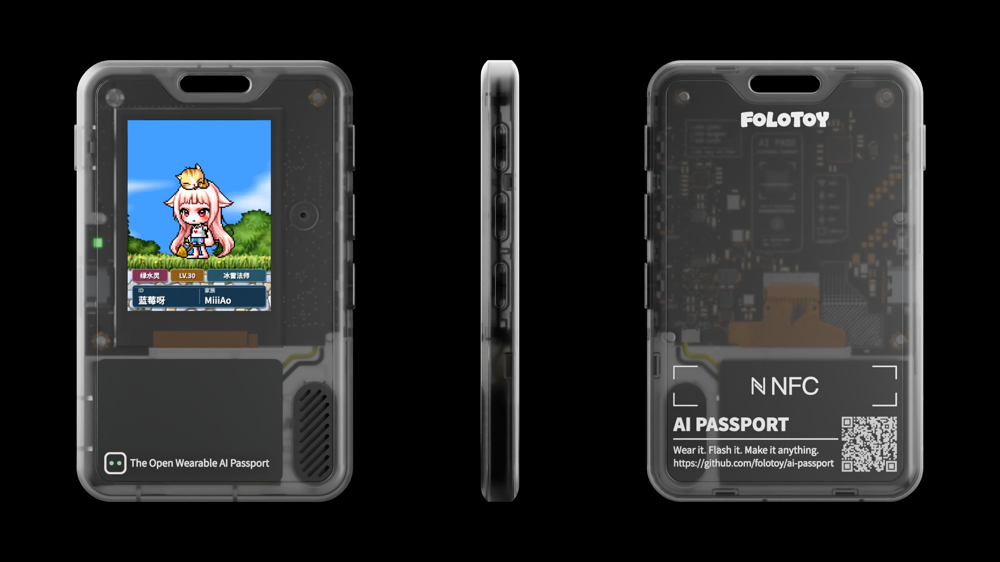

# AI Passport Maple Avatar

把冒险小册子的公开角色方案带进 FoloToy AI Passport：真实纸娃娃动画、射手村背景与角色铭牌都由同一次构建生成。



> 上图是效果示意。屏幕内容来自本项目实际生成的 240 × 320 UI，最终显示效果以设备实机为准。

## 最佳实践：固件与角色分离

社区固件只需完整安装一次，之后每个用户都可以反复更换自己的角色，不必重新编译或重刷应用固件：

1. 首次安装社区玩法固件。固件自带“蓝莓呀”示例，安装后即可预览六个动作。
2. 在[冒险小册子角色构建器](https://mxdc.dvg.cn/tools/character-builder/)保存角色并复制公开分享链接。
3. 打开 `https://avatar.miiiao.cn/`，粘贴链接，选择服务器并填写家族。
4. 页面从原链接抓取真实素材；预览确认后，用桌面版 Chrome / Edge 连接 USB。
5. 页面只把本次生成的 `avatar.pack` 写入独立角色分区，原应用、按键逻辑与设备设置不变。

角色名、等级和职业来自冒险小册子，是不可手改的来源事实；服务器和家族由用户补充。抓取失败会明确报错，不会悄悄换成示例或 AI 生成素材。在线制作台源码位于 [hiyeshu/miiiao-avatar-builder](https://github.com/hiyeshu/miiiao-avatar-builder)。

## 社区固件中的示例


- 来源：[MXDC 公开角色方案 5293](https://mxdc.dvg.cn/tools/character-builder/?build=5293&readonly=1)
- 资料：绿水灵 · LV.30 · 冰雷法师 · 蓝莓呀 · MiiiAo
- 动作：站立、行走、攻击、坐下、双手持武器站立、双手持武器行走
- 默认背景：射手村

示例包带有 `SAMPLE` 标识。上 / 下键依次切换六个动作和“制作或更换我的角色”页面；OK 键暂停或继续动画。只有一帧的动作自动静态展示。电量可读取时显示，无法读取时自然隐藏。

## 本地导入与开发

不使用在线制作台时，也可以在 Node.js 20 与 Chromium 环境中直接生成角色包：

```bash
cd tools/maple_avatar
npm ci
npm run import -- \
  'https://mxdc.dvg.cn/tools/character-builder/?build=5293&readonly=1' \
  --server '绿水灵' \
  --family 'MiiiAo'
```

区服支持：`蓝蜗牛`、`蘑菇仔`、`绿水灵`、`漂漂猪`、`小白兔`。角色名与家族最多各 6 个字符，等级最高为 999，职业最多 5 个字符。

导入器通过 Playwright 读取 `CHARACTER_BUILDER_CONFIG`，抓取真实 Canvas 动画帧和射手村背景，再统一编译为带 CRC 校验的 `avatar.pack`。CLI 与在线服务共用同一个编译模块，因此预览、下载与设备内容来自同一构建结果。

固件使用 ESP-IDF 5.5.3。激活环境后在仓库根目录运行：

```bash
./tools/validate.sh
```

该门禁执行静态检查、主机测试、ESP-IDF 构建，并验证示例角色包确实位于合并固件的 `avatar` 分区。完整说明见 [导入器文档](tools/maple_avatar/README.zh_CN.md)、[在线构建服务](services/avatar-builder/README.zh_CN.md)和[固件布局](docs/development/engineering/firmware-layout.zh_CN.md)。

## 来源与许可

本项目基于 [FoloToy 官方 ai-passport 仓库](https://github.com/FoloToy/ai-passport)开发。代码沿用仓库的 MIT License；字体与角色素材的来源、哈希和许可信息记录在对应的 [`manifest.json`](assets/images/maple-avatar/build-5293/manifest.json) 与资源说明中。

感谢[冒险小册子](https://mxdc.dvg.cn/)提供纸娃娃工具。

## 家族声明

MiiiAo是从 冒险岛世界Artale亚服 迁移至 冒险岛怀旧服绿水灵 的原生家族，家族名称为原创。

现绿水灵出现近似名家族【MiiAo】并非我们分会，双方无任何从属关系，本家族不开设分会。

如MiiAo家族后续发生纠纷、抢图、行骗等各类负面事件，均与MiiiAo家族及全体成员无关，请大家注意区分，避免误会。
